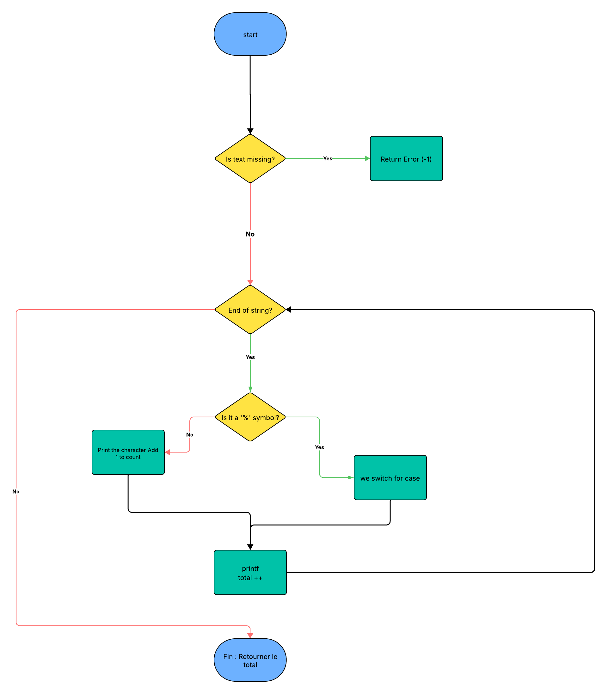

# _printf

## Description
This project recreates the standard C library function `printf`.
The `_printf` function writes output to stdout according to a specified format.
It handles conversion specifiers to print different data types.
This implementation uses variadic functions to handle variable arguments.

Supported conversion specifiers:
* `c`: Prints a single character.
* `s`: Prints a string of characters.
* `%`: Prints a percent sign.
* `d`: Prints a signed decimal integer.
* `i`: Prints a signed decimal integer.

## Requirements
* Operating System: Ubuntu 20.04 LTS
* Compiler: GCC
* Compilation flags: `-Wall -Werror -Wextra -pedantic -std=gnu89`
* Code style: Betty style compliant
* No global variables.

## Compilation
Compile all source files using the following command:

```
gcc -Wall -Werror -Wextra -pedantic -std=gnu89 *.c -o printf
```

----------------------------------------------------------------

The function prototype is:
```
int _printf(const char *format, ...);
```

----------------------------------------------------------------

1. Printing a character Input:
```
_printf("Character: %c\n", 'A');
```
Output:
Character: A

2. Printing a string Input:
```
_printf("String: %s\n", "Holberton");
```
Output:
String: Holberton

3. Printing integers Input:
```
_printf("Integer: %d\n", 1024);
_printf("Negative: %i\n", -42);
```
Output:
Integer: 1024
Negative: -42

4. Printing a percent sign Input:
```
_printf("Percent: %%\n");
```
Output:
Percent: %

----------------------------------------------------------------

Manual Page
A custom man page is included with the project. To view it, run the following command:

`man ./man_3_printf`


----------------------------------------------------------------

Testing
Functional Tests
Create a main.c file. Call _printf with various format specifiers and edge cases. Compare the return value and output with the standard printf function. Example main.c:

```
#include <limits.h>
#include <stdio.h>
#include "main.h"

int main(void)
{
    int len;
    len = _printf("Test: %s\n", "Success");
    printf("Length: %d\n", len);
    return (0);
}
```

Memory Check
Check for memory leaks using Valgrind:

`valgrind ./printf`

----------------------------------------------------------------

Flowchart
The following diagram illustrates the logic of the _printf function:



----------------------------------------------------------------

Authors

Written by Thomas Haenel and thélyaan Dufrénoy